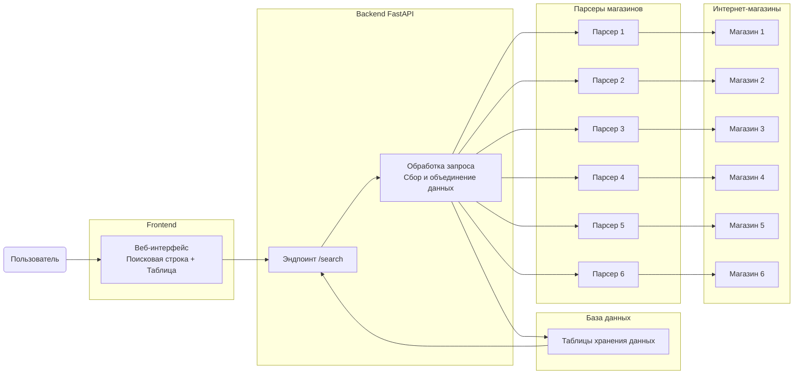
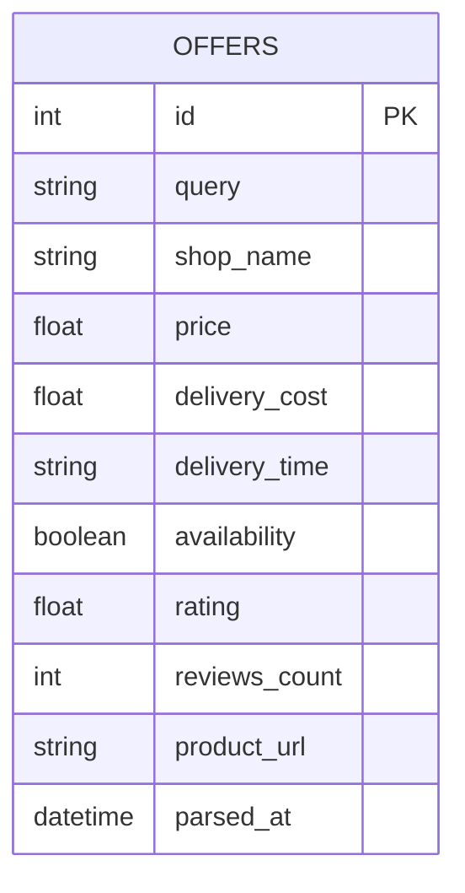

# Drip Search — документация проекта (этап 2)

---
## Команда проекта

- **Участник 1:** Дзюба Юрий (TL)
- **Участник 2:** Савельев Демьян
---

## 1. Описание проекта
**Drip Search** — веб-сервис, который помогает пользователям быстро находить самые выгодные предложения на товары в разных интернет-магазинах.  
Пользователь вводит название товара, а система автоматически собирает данные о цене, наличии, доставке и отзывах, после чего отображает их в удобной таблице сравнения.

---

## 2. Что будет видеть пользователь

### 1. Поисковая строка
Поле, куда пользователь вводит название товара.  
После нажатия кнопки поиска сервис запускает сбор данных и выводит результат.

**Поведение интерфейса:**
- до поиска отображается только строка ввода;
- после поиска появляется таблица с предложениями;
- если товар не найден — выводится сообщение об отсутствии результата.

### 2. Таблица сравнения
После поиска пользователь видит таблицу, где собраны предложения из разных магазинов.

**В таблице отображаются:**
- название магазина;
- цена товара;
- стоимость доставки;
- сроки доставки;
- наличие;
- рейтинг;
- количество отзывов;
- ссылка на товар.

Таблица позволяет быстро сравнить условия и выбрать наиболее выгодное предложение.

---

## 3. Какие задачи необходимо выполнить

### Backend
- настроить проект на FastAPI;
- реализовать эндпоинт `/search`;
- написать логику запуска парсеров и объединения результатов;
- настроить подключение к базе данных;
- вернуть данные в едином формате.

### Парсеры
- написать парсеры для нескольких магазинов;
- настроить Selenium для обхода антиботов;
- привести все ответы к единому формату.

### Frontend
- создать страницу с поисковой строкой;
- реализовать отображение таблицы сравнения;
- вывести сообщение при отсутствии результатов.

### База данных
- настроить PostgreSQL;
- создать минимальные таблицы;
- организовать хранение структурной информации.

### Инфраструктура
- скрыть секреты (логин и пароль БД) в `.env`;
- подготовить Docker-сборку проекта;
- собрать документацию и диаграммы.

### Тестирование
- написать тесты для эндпоинта поиска;
- написать тесты на объединение данных;
- обеспечить минимальное покрытие по требованиям.

---

## 4. Кто что делает?

### Участник 1 — Backend / Основные парсеры / Интеграция / Документация этапа 2
**Обязанности:**
- настройка FastAPI;
- реализация `/search`;
- написание основной части парсеров (4–5 магазинов);
- настройка Selenium;
- интеграция данных от всех парсеров;
- подготовка документации и диаграмм для этапа 2;
- тестирование backend.

**Оценка времени:**
- Backend — **1–2 дня**  
- Парсеры (4–5 магазинов) — **3–5 дней**  
- Интеграция — **1 день**  
- Документация + диаграммы — **0.5–1 день**  
- Тестирование — **0.5 дня**

---

### Участник 2 — База данных / Frontend / Часть парсеров / Финальная документация
**Обязанности:**
- настройка PostgreSQL и создание таблиц;
- подключение БД к проекту;
- создание веб-страницы поиска и таблицы;
- отображение сообщения при отсутствии результатов;
- написание части парсеров (2–3 магазина);
- подготовка финальной документации (этап 4);
- создание схем для защиты.

**Оценка времени:**
- База данных — **1–2 дня**  
- Frontend — **1–2 дня**  
- Парсеры (2–3 магазина) — **2–3 дня**  
- Финальная документация + схемы — **1–2 дня**  
- Отладка — **0.5 дня**

---

## 5. Основные функции системы

1. **Поиск товара по названию**  
   Принимает запрос и запускает обработку.

2. **Сбор данных из магазинов**  
   Парсеры получают цену, наличие, доставку и отзывы.

3. **Приведение данных к единому формату**  
   Все результаты унифицируются для дальнейшего сравнения.

4. **Формирование таблицы сравнения**  
   Система возвращает полный список предложений по товару.

5. **Обработка отсутствия результатов**  
   Выводится сообщение, если ни один магазин не дал подходящих данных.

6. **Логирование ошибок**  
   Сбои парсеров и backend фиксируются в логах для диагностики.

---

## 6. Архитектурная схема системы



---

## 7. API сервиса

### **GET /search**

Запускает поиск товара и возвращает список предложений.

**Параметры:**
- `query` — название товара (обязательно)

**Пример запроса:**
```
GET /search?query=Nike%20Air%20Force%201
```

### **Пример успешного ответа**

```json
{
  "query": "Nike Air Force 1",
  "results": [
    {
      "shop_name": "Street Beat",
      "price": 12990,
      "delivery_cost": 300,
      "delivery_time": "2–4 дня",
      "availability": true,
      "rating": 4.7,
      "reviews_count": 150,
      "product_url": "https://street-beat.ru/product/nike-air-force-1"
    },
    {
      "shop_name": "Sneakerhead",
      "price": 12490,
      "delivery_cost": 400,
      "delivery_time": "3–5 дня",
      "availability": true,
      "rating": 4.5,
      "reviews_count": 98,
      "product_url": "https://sneakerhead.ru/product/nike-air-force-1"
    }
  ]
}
```

---

## 8. База данных

Текущая схема БД используется на этапе разработки.  
К моменту защиты будет представлена актуальная финальная версия.

